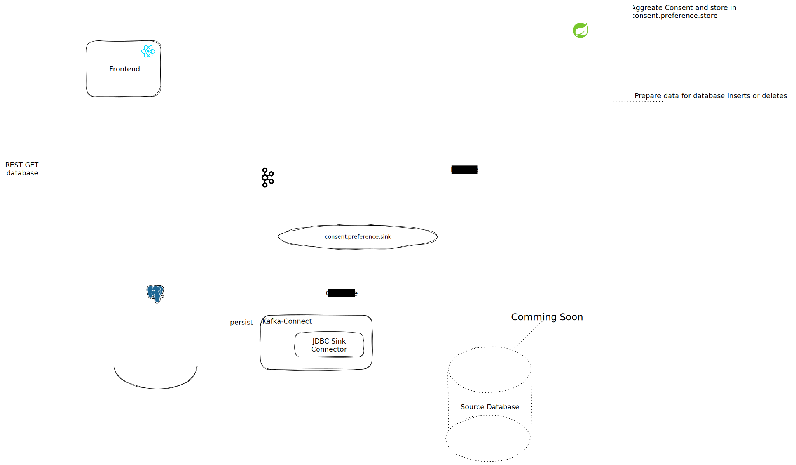

<a name="readme-top"></a>
<br />

<div align="center" >
  <a href="https://codecamp-n.com">
    
  </a>

<h3 align="center">Opt-In / Opt-Out with Apache Kafka</h3>

</div>

---

## About

Implementation of a prototypical [opt-in & opt-out process](https://www.iubenda.com/en/help/6192-opt-in-opt-out#:~:text=%F0%9F%91%89%20%E2%80%9COpt%2Din%E2%80%9D%20is,opt%20out%20of%20that%20choice.)
with [Apache Kafka](https://kafka.apache.org/) using the Kafka Streams API and Kafka Client API.
Customers can explicitly allow or prohibit marketing emails or marketing calls for specific email addresses and phone numbers.
They can subscribe or unsubscribe to receive newsletters through a simple [Next.js](https://nextjs.org) frontend.


Consent requests are written to Apache Kafka and can be distributed from there or directly read from a Kafka Streams State Store.
With the help of Kafka-Connect and the JDBC-Sink-Connector, all opt-ins and opt-outs are persisted in a postgres database. 

All opt-ins stored in Kafka, as well as those persisted in the database, can be viewed through the frontend.
For simplicity, the same frontend used for users to give opt-in or opt-out is used for this purpose.


---

## Overview



---

## Project structure

This project consists of several components that work together to manage and visualize user opt-ins and opt-outs.
The following describes each part of the project in more detail:


| Component            | Description                                                                                                                                                                                                                                                                                                                                     |
|----------------------|-------------------------------------------------------------------------------------------------------------------------------------------------------------------------------------------------------------------------------------------------------------------------------------------------------------------------------------------------|
| optin-optout         | This is the backend for our frontend that takes opt-ins and opt-outs from users and writes them to a Kafka Topic.                                                                                                                                                                                                                               |
| streams              | The Streams component contains two processors.<br>- The first processor adds a schema to advertising consent events and writes them to a topic so that the Sink connector can read the data.<br>- The second processor contains a KTable with a key-value store that aggregates opt-ins and opt-outs and makes them available using a REST API. |
| optin-optout-library | This is a library that contains the opt-in out manager. This contains the producers and the necessary events.                                                                                                                                                                                                                                   |
| frontend             | The frontend component provides users with the ability to subscribe or unsubscribe to receive newsletters. It also visualizes the current state of the State Store and the Database.                                                                                                                                                            |


We hope this overview of the project structure helps you navigate through the project.
If you have any questions or problems, please contact the project team. Thank you for your interest in our project!

---

# Installation

This section describes how to start the application, providing two different options.
The first option uses an installation script to deploy all the required resources into a Kubernetes cluster.
The second option deploys parts of the application into a Kubernetes cluster, while running the Spring Boot applications
and the frontend locally on the host system.

if you just want to try the application, choose the "Quick Installation".
If you want to debug the applications or extend them yourself, then select "Manual Installation".

## Prerequisites

- Java 19
- Kubernetes Cluster
- Docker installed
- Helm installed
- Maven installed

## A. Quick Installation


| There is one manual step you have to do first: |
|------------------------------------------------|
Download the plugin (confluentinc-kafka-connect-jdbc-10.6.0) from [confluent.io](https://www.confluent.io/hub/confluentinc/kafka-connect-jdbc) and place the
zip file in "./connectors".
Make sure you use the version 10.6.0, by selecting "Download previous versions".

After that, you can run the install and deploy script:

```shell
sh build-and-deploy-all.sh
```


## B. Manual Installation

### 1. Install strimzi operator

---
The [Strimzi kafka operator](https://github.com/strimzi/strimzi-kafka-operator) is an open-source Kubernetes operator designed to manage Apache Kafka clusters. It automates the deployment, configuration, and management of Kafka clusters, making it easier to operate and scale Kafka in a Kubernetes environment. The operator provides custom resources and controllers to create, update, and delete Kafka clusters and their associated resources, such as topics, users, and ACLs.
```bash
helm repo add strimzi https://strimzi.io/charts/
helm install strimzi strimzi/strimzi-kafka-operator
```

### 2. Create Kafka Cluster

---
This Command installs a Kafka cluster on your Kubernetes cluster.
```bash
cd helm/kafka-cluster
helm install kafka-cluster . 
```
Now you have a Kafka-Cluster running on localhost:32100

### 3. Deploy Kafka-Connect with Sink-Connector

---
To deploy Kafka-Connect we first have to build the docker image, including the JDBC-Plugin from Confluent.
Download the plugin (confluentinc-kafka-connect-jdbc-10.6.0) from [confluent.io](https://www.confluent.io/hub/confluentinc/kafka-connect-jdbc) and place the
zip file in "./connectors".
Make sure you use the version 10.6.0, by selecting "Download previous versions"

Before we can build the image we need to deploy a local registry server.

```bash
docker run -d -p 5001:5000 --name registry registry:2.7
```

Now you can build the image by running the build-local.sh script in the same folder.

```bash
cd connectors
sh build-local.sh
```
Now we need to add and install the [postgres-operator](https://github.com/zalando/postgres-operator).

```bash
helm repo add postgres-operator-charts https://opensource.zalando.com/postgres-operator/charts/postgres-operator
helm install postgres-operator postgres-operator-charts/postgres-operator
```
After adding the postgres connector we can deploy kafka-connect

```bash
cd helm/kafka-connect
helm install kafka-connect .
```


### 4. Build optin-optout-library

---
Running "mvn install" in the library directory ensures that the library's artifacts are installed
in your local maven repository, making them available to other projects that depend on them.
```bash
cd optin-optout-library
mvn install
```

### 5. Build and run optin-optout application

---
```bash
cd optin-optout
mvn install
mvn spring-boot:run
```
### 6. Build and run streams application

---
```bash
cd streams
mvn install
mvn spring-boot:run
```

### 7. Build and run Frontend

Because the database is running in kubernetes und the frontend on the host we need to set port-forwarding, to be able to access the database
```bash
kubectl port-forward sink-database-cluster-0 5432:5432
```

We need the database password as well
```bash
echo $(kubectl get secret sinkuser.sink-database-cluster.credentials.postgresql.acid.zalan.do -o 'jsonpath={.data.password}' | base64 -d)
```
insert the DATABASE_PASSWORD into
- frontend/.env.development
---
```bash
cd frontend
yarn
yarn build
yarn dev
```


# Cleanup

```bash
sh cleanup.sh
```
